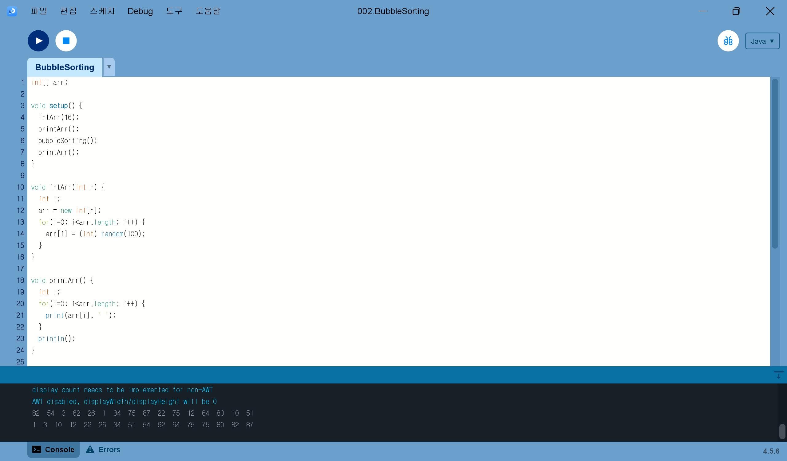
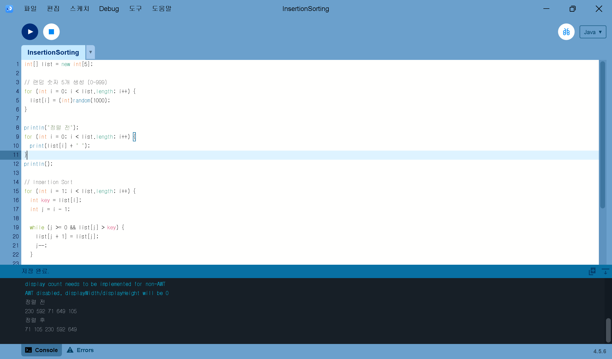
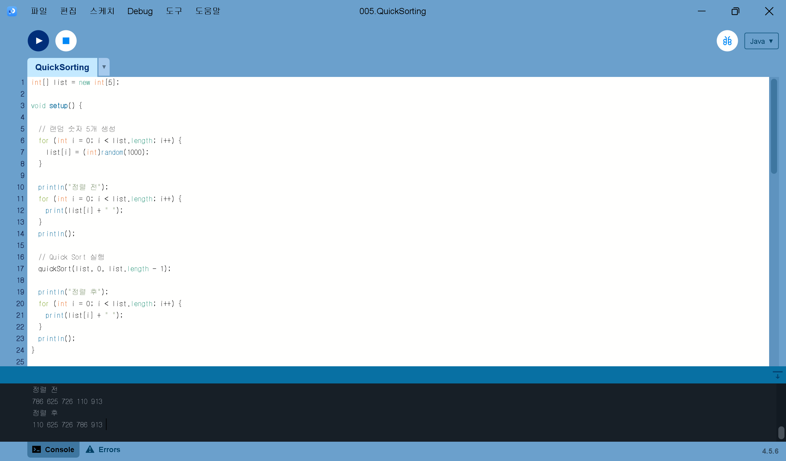
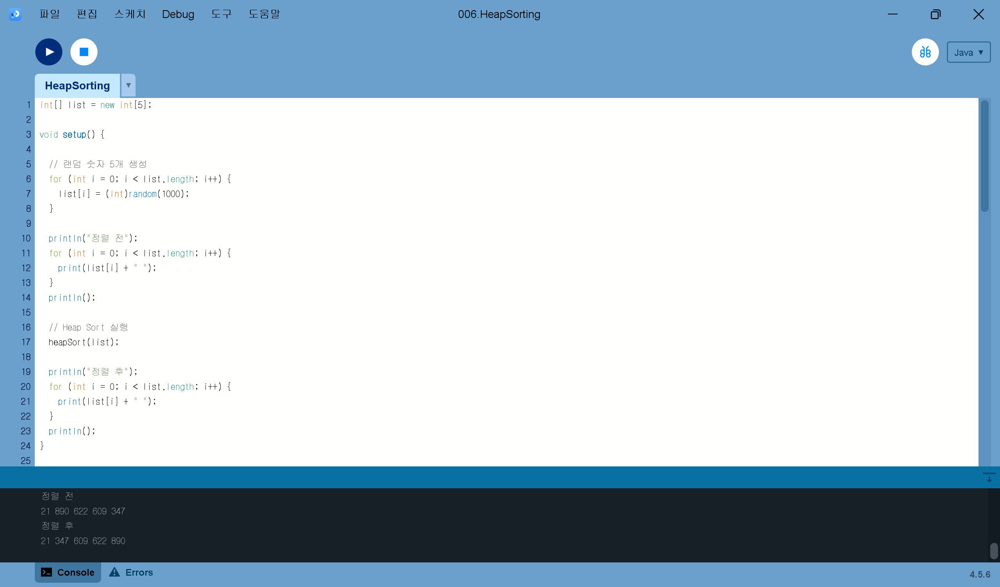

# Algorithm2026

<b>HOMEWORK 1 - Sorting Algorithms</b>

 

[SelectionSorting](homework/SelctionSorting.pde)  

[BubbleSorting](homework/BubbleSorting.pde)  

[InsertionSorting](homework/InsertionSorting.pde)  

[MergeSorting](homework/MergeSorting.pde)  

[QuickSorting](homework/QuickSorting.pde)  

[HeapSorting](homework/HeapSorting.pde)  

<b>HOMEWORK 2 - Sorting Animation</b>

 

### Sorting Animation

[SortingAnimation.pde](homework/SortingAnimation/SortingAnimation.pde)
[Array.pde](homework/SortingAnimation/Array.pde)

