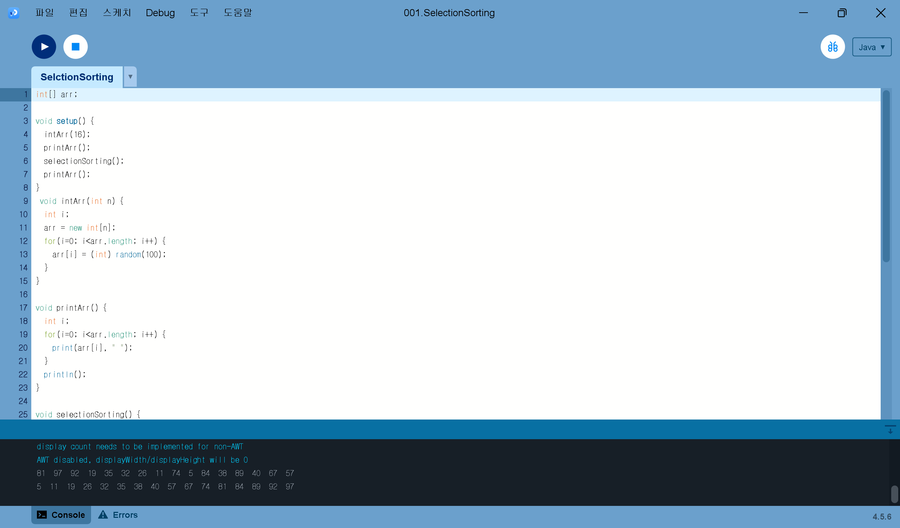
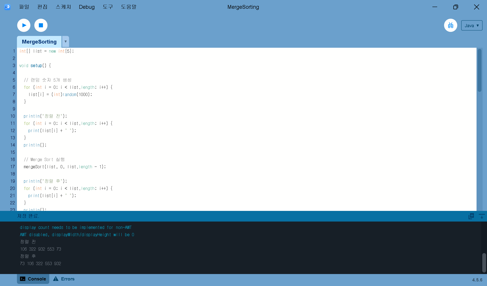
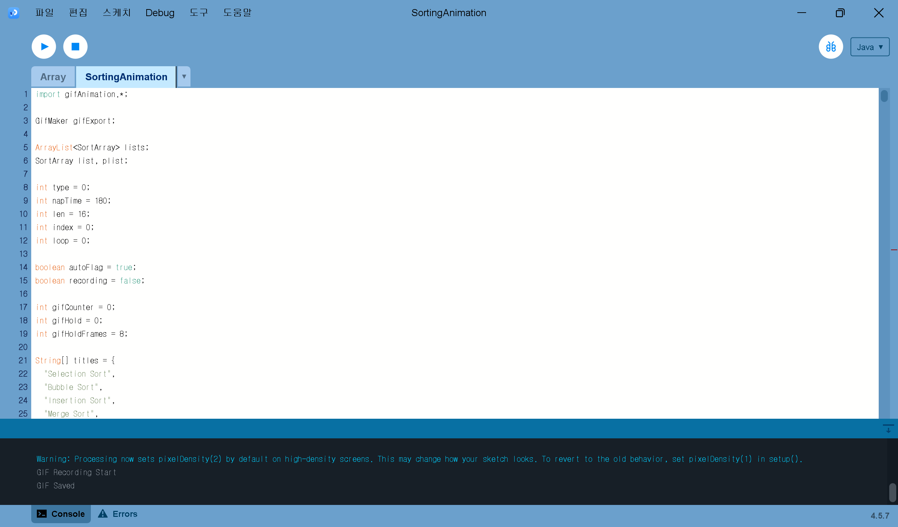
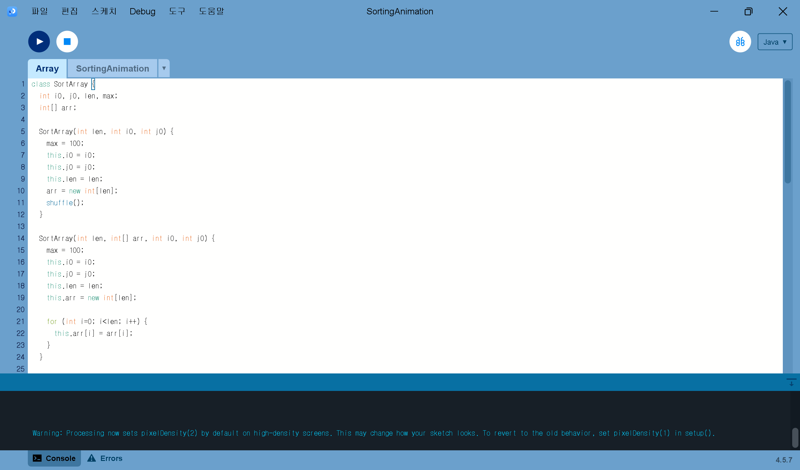
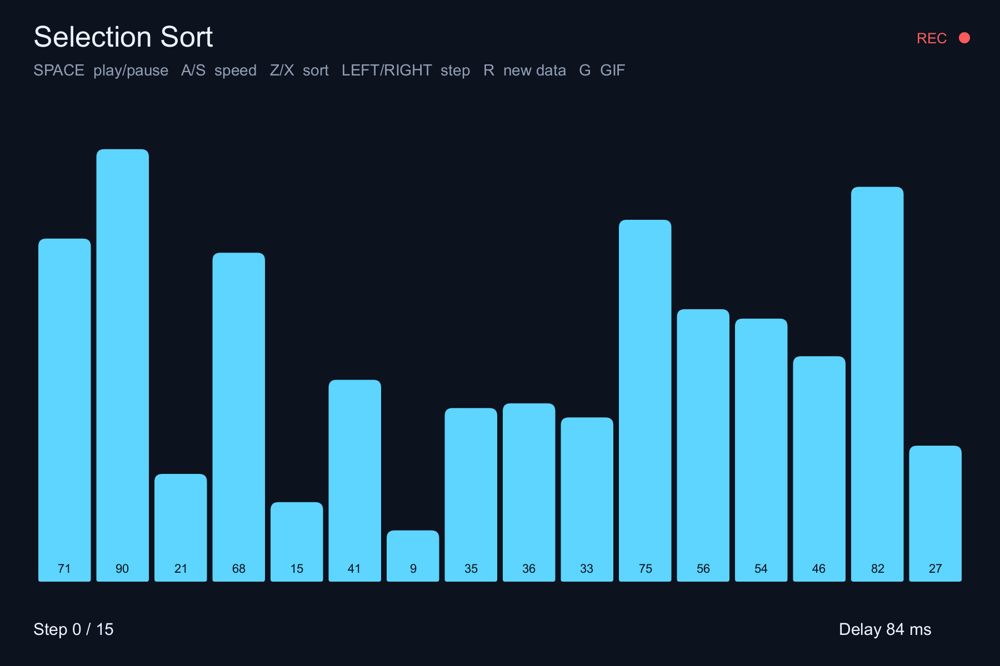

# Algorithm2026

<b>HOMEWORK 1 - Sorting Algorithms</b>

 

### Selection Sort
[SelectionSorting.pde](homework/SelectionSorting.pde)  

### Bubble Sort
[BubbleSorting.pde](homework/BubbleSorting.pde)  

### Insertion Sort
[InsertionSorting.pde](homework/InsertionSorting.pde)  

### Merge Sort
[MergeSorting.pde](homework/MergeSorting.pde)  

### Quick Sort
[QuickSorting.pde](homework/QuickSorting.pde)  

### Heap Sort
[HeapSorting.pde](homework/HeapSorting.pde)  

<b>HOMEWORK 2 - Sorting Animation</b>

 

<b>HOMEWORK 2 - Sorting Animation</b>

 

### Sorting Animation

[SortingAnimation.pde](homework/SortingAnimation/SortingAnimation.pde)  

### Array

[Array.pde](homework/SortingAnimation/Array.pde)  

### Sorting Animation

